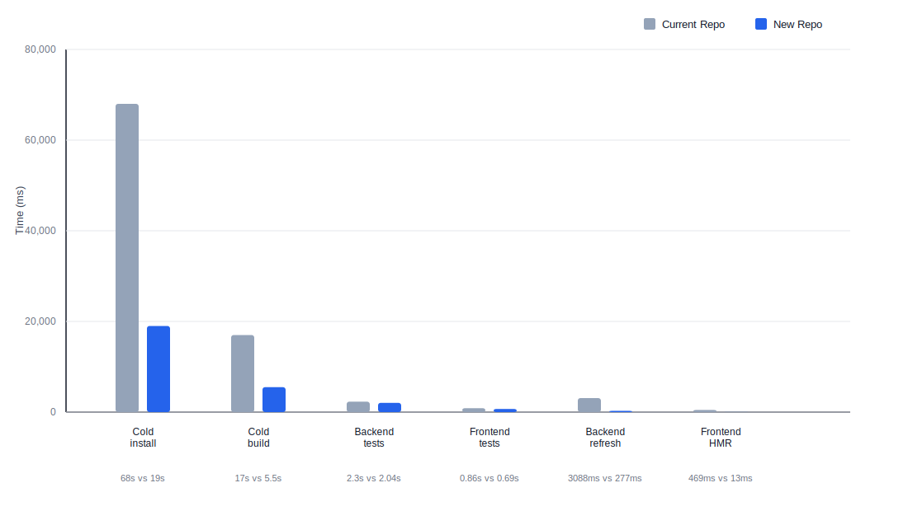

# Workflow Repo Improvement Report

## Highlights

| Area | Older state | New state | Result |
| --- | --- | --- | --- |
| Package manager | `npm` | `Bun` | Package install and run flow is faster and simpler. |
| Install flow | `prestart + setup.sh + npm install + seed` | `postinstall + prestart + setup.sh modes` | Install is faster and app start no longer waits on install work. |
| Start flow | `prestart + setup.sh` | `prestart + setup.sh --start` | Starting the app is lighter and faster. |
| Dependency lock | `package-lock.json` | `bun.lock` | Dependency installs are easier to trust. |
| Backend dev loop | `nodemon --delay 2500ms --exec babel-node` | `bun --watch` | Backend code changes show up much faster. |
| Backend build | `no build script` | `bun build + bun` | Backend build is faster and the run flow is simpler. |
| Frontend build | `react-scripts` | `Vite` | Frontend build is faster and the tooling path is cleaner. |
| Backend tests | `Mocha + Chai` | `Jest` | Backend tests run from a single Jest path. |
| Frontend tests | `none` | `Vitest` | Frontend tests have a faster dedicated path. |
| Task test runs | `backend-only npm task scripts` | `Melodio-style task dispatcher` | Task test feedback comes back faster and can support frontend task suites later. |
| Quality checks | `none` | `lint-solution-diff + typecheck-solution-diff + knip-solution-baseline` | Code issues are caught in more places. |
| Unused dependency checks | `none` | `Knip` | Unused packages are easier to spot. |
| Dependency upgrades | `npm + react-scripts + Mocha + Tailwind 3` | `Bun + Vite + Vitest + Jest + Tailwind 4` | The overall tool setup is faster and more up to date. |

## Benchmark Snapshot

Method: cold install, cold build, and backend task timings below use the VM measurements. Backend refresh and frontend HMR use the current measured comparison that was captured for this report. This repo has no frontend candidate task suite, so the frontend test row uses a temporary dummy frontend test.

| Metric | Current Repo | New Repo |
| --- | ---: | ---: |
| Cold install | `68s` | `19s` (`3.6x faster`) |
| Cold build | `17s` | `5.5s` (`3.1x faster`) |
| Backend tests, task 1 (`1` suite / `5` tests) | `2.3s` | `2.04s` (`1.1x faster`) |
| Frontend tests, dummy (`1` suite / `1` test) | `0.86s` | `0.69s` (`1.2x faster`) |
| Backend dev refresh | `3088ms` | `277ms` (`11.1x faster`) |
| Frontend HMR | `469ms` | `13ms` (`36.1x faster`) |

## Combined Bar Graph

## What Changed

### Installer, Startup, and Seed Flow

- old root start path: `prestart` ran `bash setup.sh`
- old `setup.sh` always did all of this together:
  - Mongo check/start
  - root `npm install`
  - backend `npm install`
  - frontend `npm install`
- old backend `prestart` then did `npm install && node src/utils/seed.js`
- old root `start` launched frontend and backend through npm scripts
- Bun is now the declared package manager
- `bun.lock` is now the dependency source of truth
- `postinstall` runs `bash setup.sh --ensure-seeded`
- `prestart` runs `bash setup.sh --start`
- `setup.sh --start` only does Mongo and env-file checks
- `setup.sh --ensure-seeded` seeds only when the seed signature changed
- `setup.sh --seed` is the force-seed path
- build-related checks use `bun install --frozen-lockfile --ignore-scripts`
- root `start` launches frontend and backend through Bun scripts instead of npm workspace calls

### Backend Tooling

- dev refresh moved from `nodemon + babel-node` to Bun watch mode
- backend build moved from no build script to `bun build`
- backend runtime now stays on Bun
- backend startup was split into `app.js` and `server.js`
- `express-async-errors` was removed because Express 5 handles async middleware errors directly

### Frontend Tooling

- frontend build moved from `react-scripts build` to the Vite build path
- frontend tests were split into a dedicated Vitest path
- Vitest was tuned for VM-friendly runs with `happy-dom`, `fileParallelism: false`, and a single thread
- Tailwind moved from v3 to v4
- the Workflow theme colors were restored in the Tailwind 4 setup
- the Vite dev server now allows VM `.internal` hosts

### Backend Test Changes

- older backend task tests used `Mocha + Chai + Chai HTTP`
- backend tests now use Jest
- tests run with `NODE_ENV=test`
- worker count is controlled with `maxWorkers: 1`
- root test entry points are clearer
- task-level backend runs are still supported through the shared dispatcher

### Frontend Test Changes

- the older repo had no dedicated frontend test runner
- frontend package tests now use Vitest
- frontend tests can run through root scripts without borrowing backend tooling
- this repo still has no real frontend candidate task suite
- the frontend benchmark in this report therefore uses a temporary dummy test instead of a task suite

### Lint, Typecheck, and Unused Dependency Checks

- lint flow is explicit
- typecheck flow is explicit
- Knip signal improved after cleanup
- duplicate package declarations were removed
- stale ignore rules were reduced
- manifests were pinned so dependency drift is easier to spot

Branch difference:

| Check | Optimised Question | Optimised Solution |
| --- | --- | --- |
| Lint | runs through `lint-solution-diff.mjs`, which is solution-aware | runs direct `eslint . --ext .js,.jsx,.mjs,.cjs` |
| Typecheck | runs through `typecheck-solution-diff.mjs`, which is solution-aware | runs direct frontend and backend `tsc --noEmit` |
| Unused dependency check | runs through `knip-solution-baseline.mjs`, which is solution-aware and uses candidate contracts | runs direct `knip` |

`Optimised Question` uses wrapper scripts. `Optimised Solution` runs the direct tools.

## Dependency Lock Story

Older state:

- npm-driven install story
- `package-lock.json` was the normal lockfile shape
- manifests still used `^` version ranges
- package manager choice was less explicit

Current state:

- Bun is declared in `packageManager`
- Bun is also declared in `engines`
- `bun.lock` is committed and used as the main lockfile
- manifests were pinned and `^` / `~` were removed
- build-related flows check lockfile consistency

## Dependency Upgrades

### Root-Level Tooling

| Package / Tool | Older state | New Repo |
| --- | --- | --- |
| package manager contract | `npm` | `Bun` |
| root frontend test tooling | `none` | `Vitest` |
| lint tooling | `none` | `ESLint + typescript-eslint + globals` |
| unused dependency tooling | `none` | `Knip` |
| lockfile | `package-lock.json` | `bun.lock` |

### Backend Packages

| Package | Older version | New Repo version |
| --- | --- | --- |
| `bcrypt` | `^6.0.0` | `6.0.0` |
| `dotenv` | `^16.0.3` | `16.6.1` |
| `express` | `4.18.2` | `5.2.1` |
| `jsonwebtoken` | `^9.0.3` | `9.0.3` |
| `mongoose` | `^8.7.0` | `8.23.0` |

Backend dependency cleanup also included:

- `nodemon` removed from the active dev path
- `babel-node` removed from the active dev path
- `express-async-errors` removed
- Mocha task-runner dependency path replaced by Jest on the optimised branches

### Frontend Packages

| Package | Older version | New Repo version |
| --- | --- | --- |
| `tailwindcss` | `^3.4.17` | `4.2.1` |
| `@tailwindcss/postcss` | not in old setup | `4.2.1` |
| `vite` | not in old setup | `6.4.1` |
| `@vitejs/plugin-react` | not in old setup | `4.7.0` |
| `typescript` | not in old setup | `5.9.3` |
| `react` | `18.2.0` | `19.2.4` |
| `react-dom` | `18.2.0` | `19.2.4` |
| `react-router-dom` | `^6.11.1` | `7.13.1` |
| frontend test runner | `none` | `Vitest` |

### Dependency Cleanup

- duplicate root package declarations were removed
- frontend-owned and backend-owned packages were kept in the right workspace
- manifests were pinned instead of using `^` and `~`
- Knip ignore rules were cleaned up
- the repo now has a more honest unused-dependency signal

## Styling and Library Upgrade Work

- Tailwind was upgraded to v4
- the Workflow color palette was restored
- the theme setup was aligned with what the app expects
- Vite host allowlisting was aligned for VM access
- the Tailwind 4 cascade issue was fixed by moving the global reset into `@layer base`

## Small Code-Side Cleanup

- script entry points were simplified so install, start, seed, build, and test responsibilities are easier to follow
- backend startup was split cleanly into app boot and server boot
- redundant dependency declarations at the root were removed so workspace ownership is clearer
- stale Knip ignore rules were cleaned up so unused dependency reporting is more honest
- frontend and backend test entry points were aligned so each side is easier to target
- candidate-contract handling was made honest for this repo by keeping the frontend contract empty on `main`

## Final Summary

Compared with `Current Repo`, `New Repo` is clearly ahead on most of the tooling and workflow benchmarks in this report.

- cold install is much faster
- cold build is much faster
- the backend task benchmark is faster
- the dummy frontend test benchmark is faster
- backend save-and-refresh time is dramatically faster
- frontend HMR is also faster on the measured comparison

At the repo level, install, lockfile handling, backend dev, backend build, frontend build, test targeting, and dependency hygiene are all in a cleaner state than the older setup.
