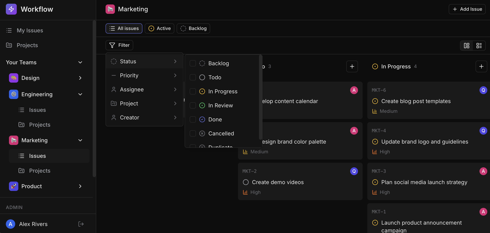

# Feature: Advance Issue Filters

`Easy`

## Overview

**Skills:** Node.js (Basic)
**Recommended Duration:** 25 Minutes

Workflow is a project management platform where teams create and manage issues, track progress, and collaborate. The issues list page includes filter controls for narrowing down issues by various criteria such as status, priority, assignee, and more.

Currently, the filter UI is fully implemented on the frontend, but the backend does not process any filter parameters. Regardless of which filters a user selects, the issues list always returns every issue in the team. Adding server-side filtering is essential for teams with large backlogs to quickly find relevant issues.

You need to build the backend filtering logic for the team issues listing endpoint.



**Note:** The code repository may intentionally contain other issues that are unrelated to this specific task. Focus only on the described task requirements.

## Product Requirements

- Users can filter issues by status (e.g., "todo", "in_progress", "done"). Selecting a single status shows only issues with that status.
- Users can filter by multiple statuses at once (e.g., "in_progress" and "done" together). Issues matching any of the selected statuses are returned.
- Users can filter issues by priority (e.g., "high", "urgent", "low"). Single and multiple priority filtering works the same way as status.
- Users can filter issues by assignee to see only issues assigned to a specific team member.
- Users can filter issues by creator to see only issues created by a specific team member.
- Users can filter issues by parent relationship — showing only root-level issues (no parent) or only direct children of a specific issue.
- Multiple filters can be applied at the same time. When combined, only issues matching all selected filters are returned (AND logic).
- When no issues match the applied filters, an empty list is shown.
- When no filters are selected, all issues in the team are returned as before.

## Steps to Test Functionality

1. Log in using credentials:
   ```
   Email: alice@workflow.dev
   Password: Password@123
   ```
2. Navigate to a team's issues list that contains issues with various statuses, priorities, and assignees.
3. Use the status filter to select "Todo" — verify that only issues with "Todo" status are shown.
4. Select multiple statuses (e.g., "In Progress" and "Done") — verify that issues matching either status are shown.
5. Use the priority filter to select "High" — verify that only high-priority issues appear.
6. Filter by a specific assignee — verify that only issues assigned to that person are shown.
7. Filter by a specific creator — verify that only issues created by that person are shown.
8. Filter for root-level issues (no parent) — verify that only top-level issues without a parent appear.
9. Combine multiple filters (e.g., status "Todo" and priority "High") — verify that only issues matching both criteria are shown.
10. Apply a filter combination that matches no issues — verify that an empty list is displayed.

**Note:** Make sure to review the `technical-specs/AdvancedIssueFilters.md` file carefully to understand all the specifications.
