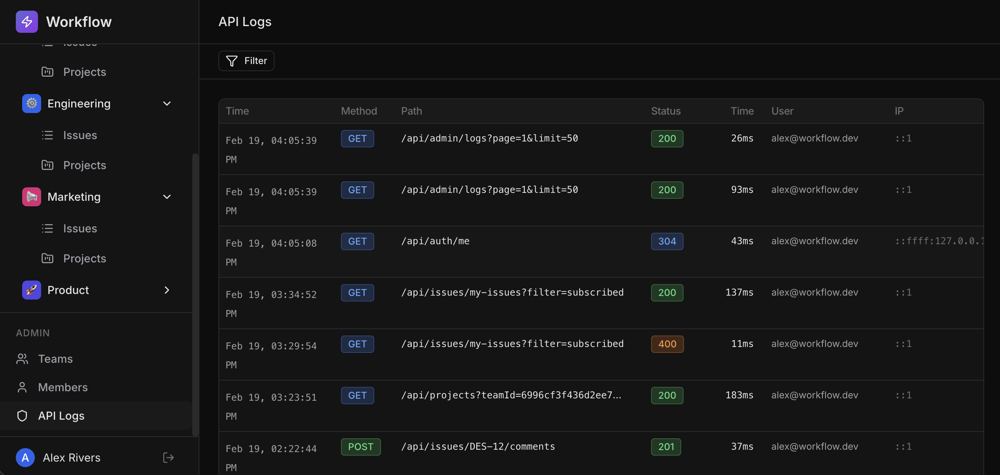

# Feature: API Loggers

`Hard`

## Overview

**Skills:** Node.js (Advanced)
**Recommended Duration:** 60 Minutes

Workflow is a project management platform where teams create and manage issues, track progress, and collaborate. As the platform scales, the engineering team needs visibility into how the API is being used — which endpoints are most frequently called, which requests are slow, and where errors are occurring.

Currently, there is no API request logging. The UI already includes a fully implemented API Logs page — accessible from the sidebar at the bottom for admin users — with filters, search, sorting, and pagination. The backend currently returns sample data to demonstrate the expected UI behavior, but it does not record any actual requests. Admin-only access to these endpoints is also not enforced.

You need to remove the sample data implementation and build the actual backend API logging system: a middleware that automatically records every request, and admin endpoints that serve the logged data with filtering, search, sorting, and pagination.



**Note:** The code repository may intentionally contain other issues that are unrelated to this specific task. Focus only on the described task requirements.

## Product Requirements

- Every API request is automatically logged with key details such as HTTP method, URL path, status code, response time, user info, IP address, and request/response data. Sensitive data (passwords, tokens, API keys, authorization headers) is redacted, and large payloads are truncated to optimize storage.
- Requests taking longer than 1 second are flagged as slow, and responses with status codes 400 or above are flagged as errors.
- Logging is performed asynchronously to ensure it does not impact user response times.
- Access to logs is restricted to admin users only; non-admin and unauthenticated users are denied access.
- Admins can view paginated logs and apply filters by HTTP method, status (range or exact code), date range, specific user, and by slow or error requests.

## Steps to Test Functionality

1. Log in as an admin user using credentials:
   ```
   Email: alex@workflow.dev
   Password: Password@123
   ```
2. Navigate around the application (view issues, teams, etc.) to generate some API activity.
3. Open the API Logs page from the sidebar — verify that the requests you just made appear in the log list.
4. Verify that each log entry shows the method, path, status code, response time, and timestamp.
5. Try accessing the logs page as a non-admin user — verify that access is denied.
6. Use the pagination controls to navigate through log pages — verify page numbers, next/previous indicators, and page sizes work correctly.
7. Filter logs by HTTP method, status code, date range and user — verify that only matching requests are shown.
8. Toggle the slow request and error request filters — verify the correct entries appear.
9. Use the search box to search by URL path, email, or IP address — verify matching results.
10. Apply multiple filters simultaneously — verify the results match all selected criteria.
11. Change the sort order (e.g., sort by response time ascending) — verify the entries reorder correctly.
12. Click on a single log entry to view its full details — verify all captured data is displayed.

**Note:** Make sure to review the `technical-specs/ApiLogger.md` file carefully to understand all the specifications.
