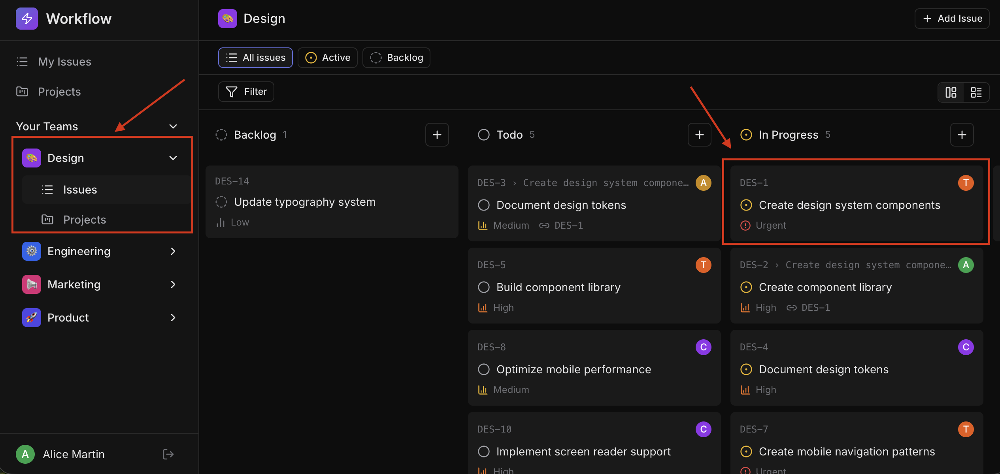
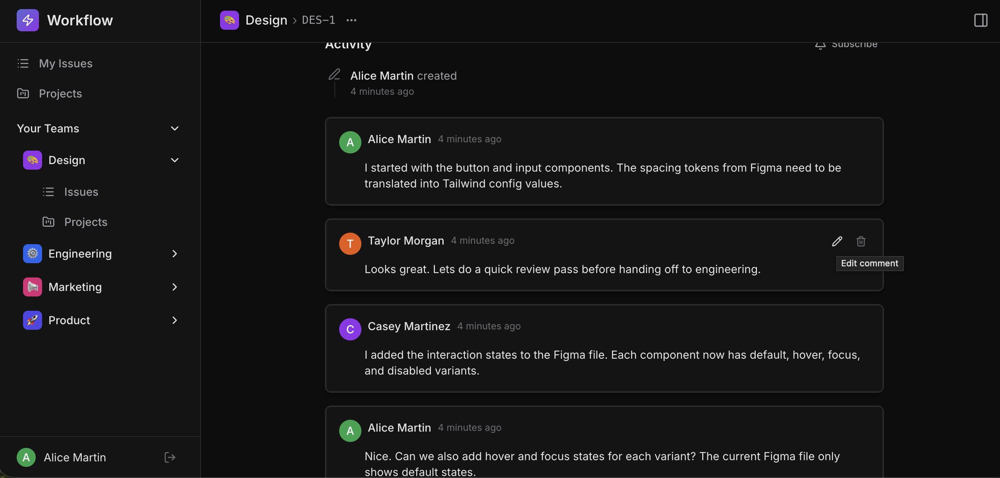

# Bug Fix: Comment Access Control

`Easy`

## Overview

**Skills:** Node.js (Basic)
**Recommended Duration:** 30 Minutes

Workflow is a project management platform where teams create and manage issues, track progress, and collaborate through comments. Comments are a core part of issue collaboration, allowing team members to discuss work, provide updates, and share context.

Currently, the comments system has critical access control issues that compromise data integrity and user trust. Any user can modify or remove another user's comments

## Issue Summary

The UI for comments is already fully implemented and works correctly, it relies on backend response fields to control what users see and can do. However, due to backend bugs, edit and delete buttons show up on all comments, including those from other users, and the "edited" tag is missing after updates. Any user can edit or delete comments, regardless of ownership, and unauthenticated requests are not being rejected.

**Note:** The code repository may intentionally contain other issues that are unrelated to this specific task. Focus only on the described task requirements.

## Steps to Reproduce

1. Log in using credentials:
   ```
   Email: alice@workflow.dev
   Password: Password@123
   ```
2. Select the **Design** team from the sidebar. This team has issues with comments from multiple users.
3. Open **DES-1 ("Create design system components")** — this issue has comments from Alice, Taylor, and Casey.
   
4. Observe that the edit and delete buttons appear on all comments, including those written by Taylor and Casey; they should only appear on Alice's own comments.
   
5. Click edit on a comment written by Taylor or Casey, and observe that the update succeeds when it should be restricted.
6. Edit one of Alice's own comments and observe that no "edited" tag appears on the comment card afterward.
7. You can also check **DES-5** and **DES-14** for additional comment threads to verify your fix works across multiple issues.

## Expected Behavior

- The edit and delete buttons should only appear on comments owned by the currently logged-in user. Not even to the Admins
- Only the comment author should be able to edit and delete their own comments. Attempts by other users should be denied with an appropriate error.
- When a comment is successfully edited by its owner, an "edited" tag should appear on the comment card and this status should persist.
- Editing and deleting comments should require authentication. Unauthenticated attempts should be rejected.

**Note:** Make sure to review the `technical-specs/CommentsAccessControl.md` file carefully to understand all the specifications.
