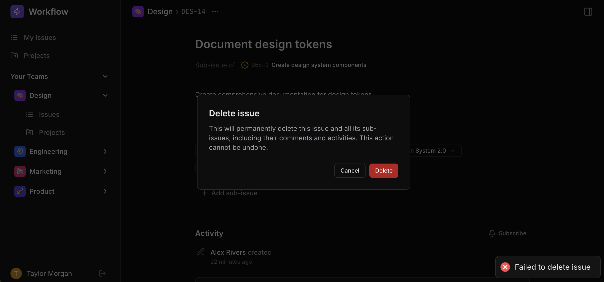

# Feature: Delete Issue

`Medium`

## Overview

**Skills:** Node.js (Intermediate)
**Recommended Duration:** 40 Minutes

Workflow is a project management platform where teams create and manage issues, track progress, and collaborate. Issues can be organized in parent-child hierarchies, and each issue may have associated comments and activity records.

Currently, there is no way to delete issues. The UI already includes a delete option on the issue detail page — accessible by clicking the options button on the issue breadcrumb — but the backend does not support the delete operation yet. You need to build the backend delete functionality that removes an issue and automatically cleans up all related data.



**Note:** The code repository may intentionally contain other issues that are unrelated to this specific task. Focus only on the described task requirements.

## Product Requirements

- Users can delete an issue. The issue is permanently removed from the system.
- When an issue with sub-issues is deleted, all descendant sub-issues are also deleted automatically (cascade deletion). This includes children, grandchildren, and any deeper levels in the hierarchy.
- When issues are deleted, all comments associated with those issues are also removed.
- When issues are deleted, all activity records associated with those issues are also removed.
- The deletion confirms how many issues were removed in total (the target issue plus all its descendants).
- Deleting a child issue does not affect its parent or sibling issues. Only the targeted issue and its sub-tree are removed.
- Attempting to delete a non-existent issue shows an appropriate error.
- Only authenticated users can delete issues. Unauthenticated requests are rejected.

## Steps to Test Functionality

1. Log in using credentials:
   ```
   Email: alice@workflow.dev
   Password: Password@123
   ```
2. Create an issue, delete it, then verify removal and report count as 1.
3. Create a hierarchy of issues: Parent → Child → Grandchild. Delete the parent issue and verify that all three issues are removed, with the deletion report indicating a count of 3.
4. Create a parent issue and a child issue, including comments and activity records. Delete the parent issue and verify that the comments and activity records for both issues are removed.
5. Create a parent issue with a child issue. Delete only the child issue—verify that the parent still exists and only the child is removed.
6. Attempt to delete a non-existent issue and verify that an appropriate error is shown.

**Note:** Make sure to review the `technical-specs/DeleteIssue.md` file carefully to understand all the specifications.
