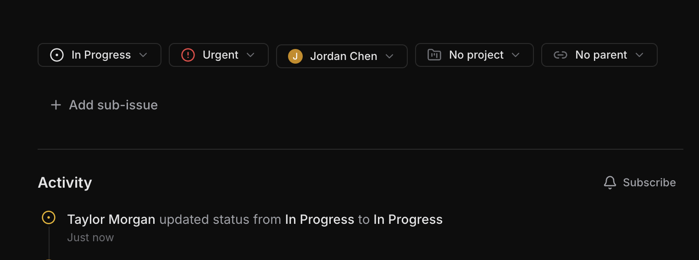
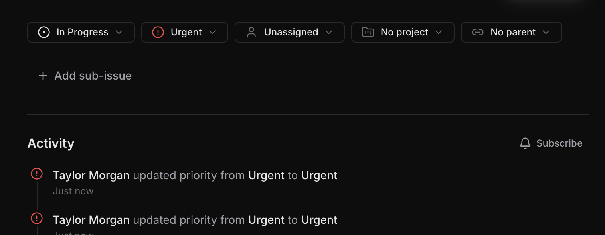

# Bug Fix: Issue Activity Tracker

`Easy`

## Overview

**Skills:** Node.js (Basic)
**Recommended Duration:** 30 Minutes

Workflow is a project management platform where teams create and manage issues, track progress, and collaborate. Each issue has an activity timeline that records lifecycle events such as status changes, priority updates, reassignments providing an audit trail of everything that has happened to an issue.

Currently, the activity tracking system has several bugs that result in missing, incorrect, or misordered activity entries. This undermines the reliability of the audit trail and makes it difficult for team members to understand the history of an issue.

## Issue Summary

The UI for the activity timeline is already fully implemented and relies on backend data to display activity entries. However, due to backend bugs, the activity timeline does not function correctly. When a user changes an issue's title or description, no activity entry appears in the timeline. For other field changes, the old and new values displayed in the activity entry are incorrect. When a field is cleared (e.g., removing an assignee or unlinking a project), the change is not recorded. Additionally, if a field is updated to the same value it already has, a spurious activity entry may appear. The activity timeline also displays entries in the wrong order — older entries appear at the top instead of the most recent ones.

**Note:** The code repository may intentionally contain other issues that are unrelated to this specific task. Focus only on the described task requirements.

## Steps to Reproduce

1. Log in using credentials:
   ```
   Email: alice@workflow.dev
   Password: Password@123
   ```
2. Navigate to an existing issue and open the activity timeline.
3. Change the issue's title and observe that no new activity entry appears in the timeline.
4. Change the issue's status (e.g., from "Todo" to "In Progress") and observe that an activity entry appears, but the old and new values shown are incorrect or swapped.
   
5. Assign the issue to a team member, then unassign the member. Note that the unassignment is not recorded in the timeline.
6. Update the status to the same value it already has and observe that a duplicate activity entry is created when none should appear.
   
7. Notice that the activity timeline shows entries in the wrong order, with older changes appearing before more recent ones.

## Expected Behavior

- When an issue's title or description is changed, an activity entry should appear in the timeline recording the change.
- When any tracked field listed here (status, priority, assignee, title, description, project, parent) is changed, the activity entry should correctly show the previous and new values.
- When a field is cleared (e.g., assignee set to none, project removed), the change should be recorded in the activity timeline.
- When a field is updated to the same value it already has, no activity entry should be created.
- When multiple fields are changed at once, a separate activity entry should be created for each changed field.
- The activity timeline should display entries in reverse chronological order, with the most recent activity at the top. When entries share the same timestamp, the most recently created one should appear first.

**Note:** Make sure to review the `technical-specs/IssueActivityTracker.md` file carefully to understand all the specifications.
