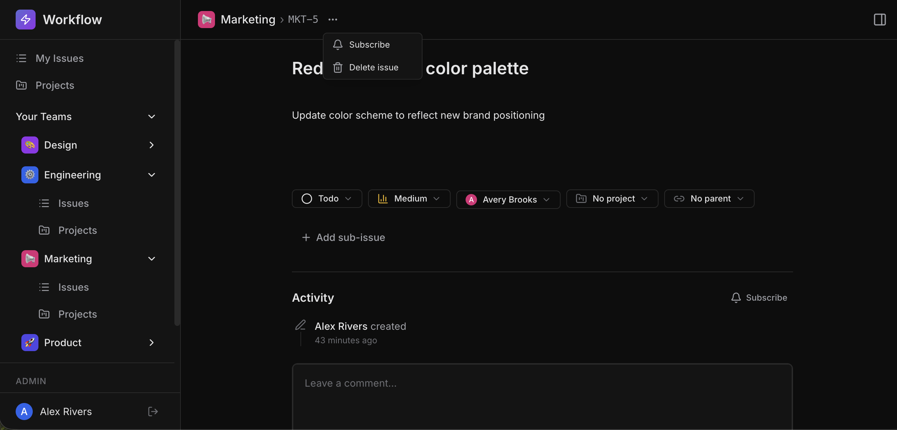
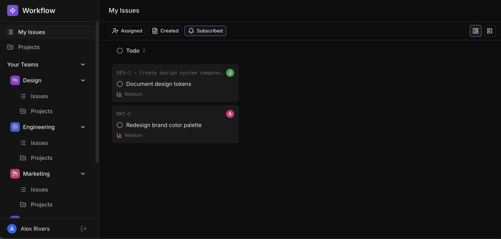

# Feature: Issue Subscribe

`Medium`

## Overview

**Skills:** Node.js (Intermediate)
**Recommended Duration:** 40 Minutes

Workflow is a project management platform where teams create and manage issues, track progress, and collaborate. As teams expand and projects grow more complex, users need a way to track specific issues they care about, even if they didn't create them or aren't assigned to them.

Currently, there is no way for users to subscribe to issues. The UI already includes a subscribe button on the issue detail page, a subscription status indicator, and a "Subscribed" filter on the My Issues page, but the backend does not support any of this functionality yet.

You need to build the backend subscription system that allows users to subscribe to and unsubscribe from issues.



**Note:** The code repository may intentionally contain other issues that are unrelated to this specific task. Focus only on the described task requirements.

## Product Requirements

- Users can subscribe to an issue by clicking the subscribe button. Clicking it again unsubscribes them (toggle behavior).
- When a user subscribes, their subscription is confirmed. When they unsubscribe, the removal is confirmed.
- Multiple users can subscribe to the same issue independently. Unsubscribing one user does not affect other users' subscriptions.
- Attempting to subscribe to a non-existent issue shows an appropriate error.
- The "My Issues" page supports a "Subscribed" filter that shows only issues the current user is actively subscribed to.
- The subscribed filter returns all issues a user is subscribed to across all teams.

## Steps to Test Functionality

1. Log in using credentials:
   ```
   Email: alice@workflow.dev
   Password: Password@123
   ```
2. Navigate to any issue's detail page and click the subscribe button — verify the UI confirms the subscription.
3. Click the subscribe button again — verify the UI confirms the unsubscription.
4. Have two different users subscribe to the same issue — verify both subscriptions are independent (unsubscribing one does not affect the other).
5. View the issue detail page — verify it shows whether you are subscribed, and that a different user sees their own subscription status.
6. Navigate to "My Issues" and select the "Subscribed" filter — verify it shows all issues you are subscribed to.
   
7. Unsubscribe from an issue, then check the "Subscribed" filter — verify the issue no longer appears in the list.

**Note:** Make sure to review the `technical-specs/IssueSubscribe.md` file carefully to understand all the specifications.
