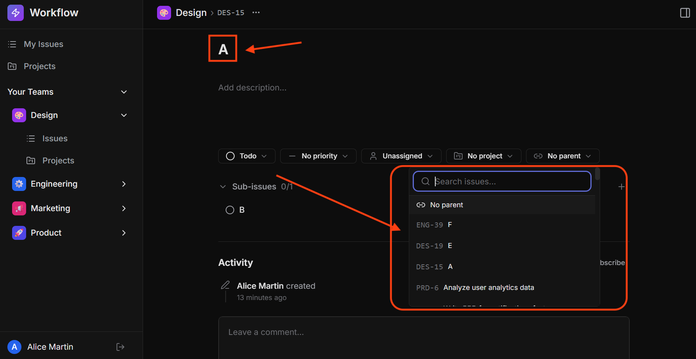

# Bug Fix: Sub Issue Hierarchy

`Hard`

## Overview

**Skills:** Node.js (Advanced)
**Recommended Duration:** 50 Minutes

Workflow is a project management platform where teams create and manage issues, track progress, and collaborate. Issues can be organized in parent-child hierarchies, allowing teams to break down large tasks into sub-issues up to 5 levels deep. A "valid parents" feature helps users pick only legitimate parent issues when restructuring their hierarchy.

Currently, the sub-issue hierarchy system has multiple validation bugs that allow invalid parent-child relationships. These bugs compromise data integrity and can lead to circular references, orphaned chains, and issues nested beyond the allowed depth.

## Issue Summary

The UI for managing sub-issue hierarchies is already fully implemented and relies on backend validation and data to function correctly. However, due to backend bugs, the parent selector dropdown shows invalid options, including the issue itself and issues from other teams. When a user attempts to set an issue as its own parent or assign a descendant as a parent (which would create a circular reference), the system accepts the change instead of rejecting it. The depth limit is also miscalculated, allowing issues to be nested beyond 5 levels in some cases and incorrectly rejecting valid operations in others.

**Note:** The code repository may intentionally contain other issues that are unrelated to this specific task. Focus only on the described task requirements.

## Steps to Reproduce

1. Log in using credentials:
   ```
   Email: alice@workflow.dev
   Password: Password@123
   ```
2. Create a hierarchy of issues: A → B → C → D (four levels deep) and a standalone issue E, all in the same team. Also create an issue F in a different team.
3. Open issue A and look at the parent selector, observe that A itself appears as a valid parent option, and issue F from the other team also appears.
   
4. Open issue A and attempt to set it as its own parent, observe that the operation succeeds when it should be rejected.
5. Attempt to create a sub-issue under D (5th level), this should succeed. Then attempt to create another level under that (6th level), observe that the depth limit is not correctly enforced.

## Expected Behavior

- The parent selector should exclude the issue itself, an issue cannot be its own parent.
- The parent selector should exclude all descendants (children, grandchildren, and deeper), not just direct children.
- The parent selector should only show issues from the same team.
- Setting an issue as its own parent should be rejected with an appropriate error.
- Setting a direct child as a parent should be rejected as a circular reference.
- Setting an indirect descendant (e.g., a grandchild or deeper) as a parent should also be rejected as a circular reference.
- Sub-issues can be nested up to 5 levels deep. Creating a 5th-level child should succeed, but attempting a 6th level should be rejected.

**Note:** Make sure to review the `technical-specs/SubIssueHierarchy.md` file carefully to understand all the specifications.
